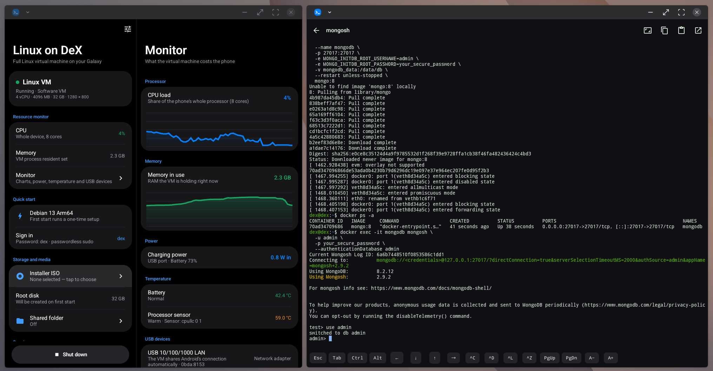
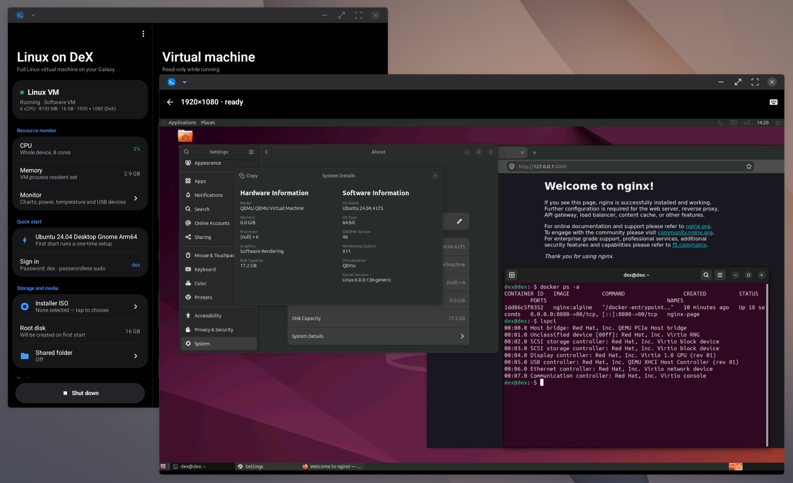
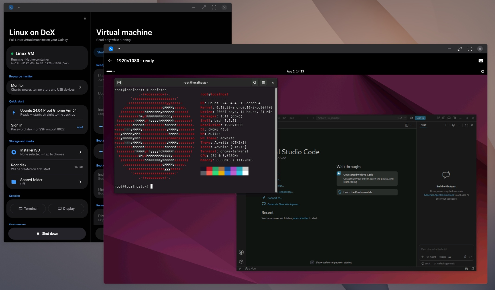
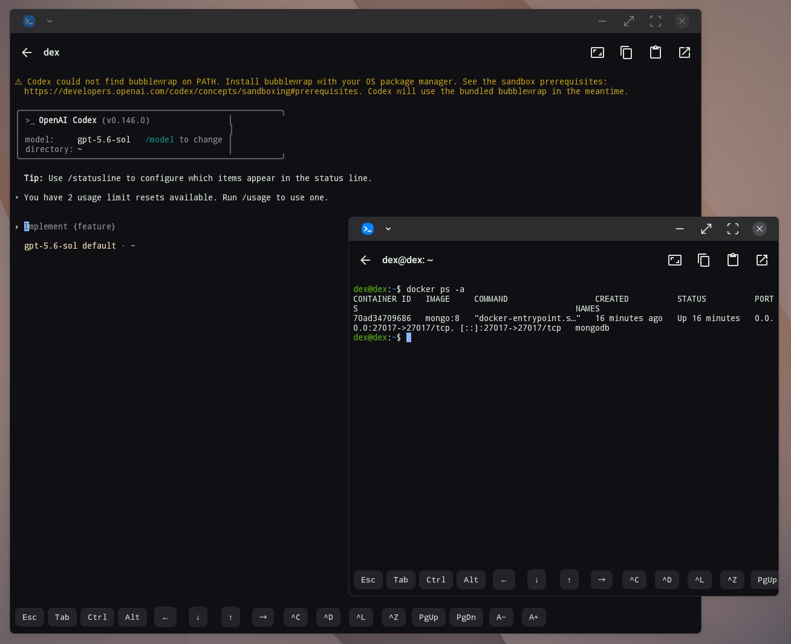
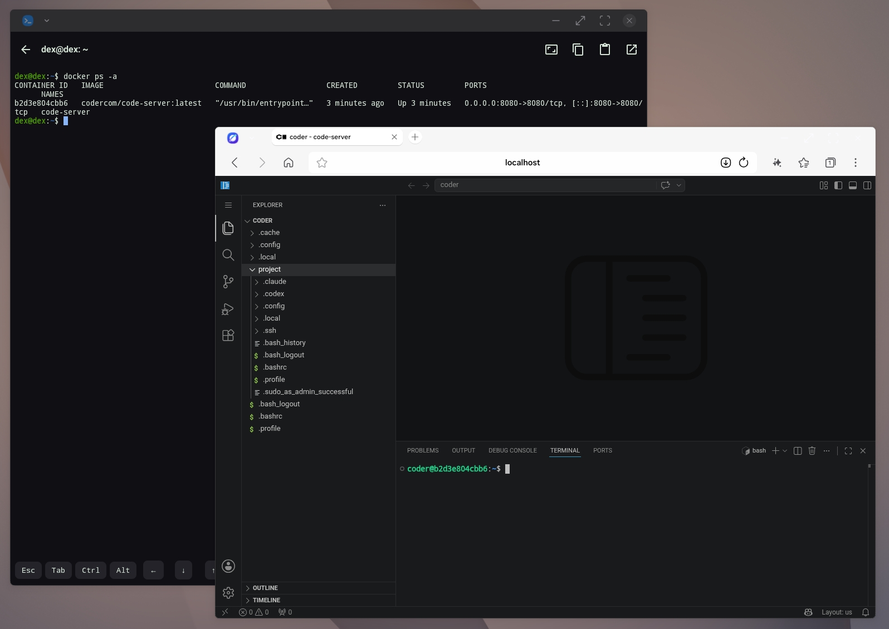
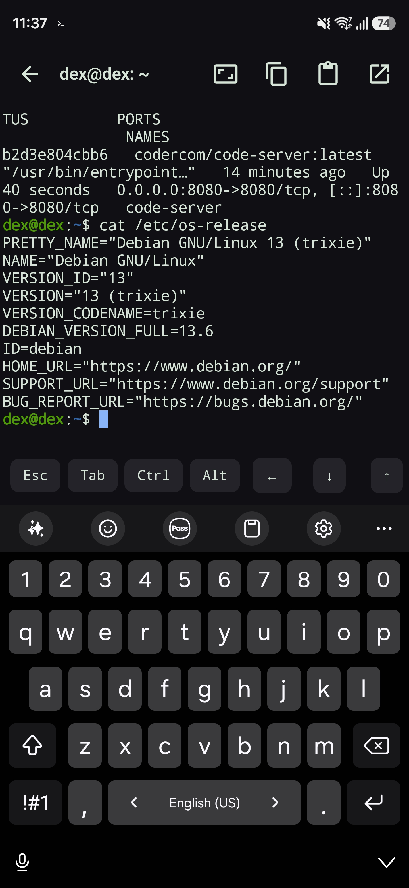

<div align="center">

# Linux on DeX

**Run a Linux VM with a full Linux server and desktop on your Android phone. No root.**

A real Linux VM with its own kernel - so **Podman, Docker and LXC** work exactly like they do on a server, with multiple Linux distros to choose from. When smoothness matters more than a separate kernel, the **GNOME Ubuntu desktop container** runs through PRoot at native CPU speed.

[](https://github.com/CRUNZEX/linux-on-dex/releases)
[](https://github.com/CRUNZEX/linux-on-dex/stargazers)














</div>

## What you get

- **Multiple Linux distros** - Ubuntu, Debian, Kali and Alpine
- **Podman, Docker and LXC** - pre-installed and ready the moment the Alpine image boots
- **A real VM** - Linux on a custom kernel via QEMU, or hardware-accelerated on supported KVM devices; QEMU uses a VirtIO virtual GPU and a local RFB viewer
- **In-app terminal** - a real terminal emulator with an extra key row, copy and paste, and live resize
- **GUI Linux support** - QEMU uses the built-in RFB viewer; current PRoot images use an embedded native X server and SurfaceView
- **Native-speed GNOME desktop** - real GNOME Shell/Mutter on PRoot, with VS Code, Firefox, SSH and git preinstalled
- **Accelerated PRoot graphics** - Mesa virpipe through a bundled native virgl renderer and ANGLE Vulkan, verified at every desktop start with automatic llvmpipe fallback
- **Live USB passthrough (Beta)** - attach and detach configured storage or network adapters while QEMU is running
- **Network port forwarding** - map phone ports to VM ports, applied live while the VM runs

## Quick Setup

1. [Download the APK](https://github.com/CRUNZEX/linux-on-dex/releases/latest) and install it.
2. [Download a ready-made image](https://github.com/CRUNZEX/linux-on-dex/releases/latest) - a `*.qcow2` VM disk, or a `*.rootfs.tar.gz` GNOME/XFCE desktop container - then import it in the app.
3. Adjust the specs to your liking - processors, memory, disk, display.
4. Tap **Start Linux**.

## Display architecture

Version `1.3.0-beta4` keeps the two runtimes separate:

```text
QEMU  -> VirtIO GPU -> QEMU VNC server -> RfbClient -> VncView
PRoot -> X11 applications -> Unix X11 socket -> native X server -> SurfaceView
```

The QEMU path follows the same local-RFB principle used by Proxmox/noVNC, but uses the app's native RFB client instead of a browser. It remains bound to `127.0.0.1`; VNC is also the compatibility fallback for PRoot images built before `1.3.0-beta1`.

New PRoot images contain `/usr/local/share/linux-on-dex/display-backend` with `native-x11`. They do not include TigerVNC. X11 clients communicate through `/tmp/.X11-unix/X1`, while OpenGL applications may opt into the separately verified virgl bridge. The X server runs in a private, bound `:x11` Android service process instead of an `app_process` child. Beta 4 also loads the renderer through Android's native-library loader, fixing APK-internal paths being passed to `dlopen`. Beta 2 rootfs artifacts remain compatible because the guest socket contract is unchanged.

After a PRoot archive is extracted and stamped successfully, the app replaces only its imported compressed copy with a small descriptor; the original file selected in the document picker is not modified. This avoids retaining the compressed archive beside the expanded rootfs. Extraction keeps 2 GB of Android storage in reserve, and each start clears session-only VM cache files. A portable PRoot backup still requires the original archive to be retained or reimported.

## Build and verification

Use JDK 17 and an Android SDK containing API 36:

```sh
./gradlew testDebugUnitTest compileDebugAndroidTestKotlin lintDebug assembleDebug
cd tools && python3 -m unittest test_proot_rootfs_builder.py test_proot_xfce_rootfs_builder.py
```

The rootfs-builder tests require PyYAML. The installable debug APK is written to `app/build/outputs/apk/debug/app-debug.apk`. A release build additionally requires the signing properties documented in `app/build.gradle.kts`.

The embedded X11 renderer is an ARM64 Termux:X11-derived component. Its source provenance, modifications, checksum, and license are under `third_party/termux-x11/`.

Release APKs must use the dedicated `keystore/crunzex-release.jks` key (kept outside Git), never the generic Android Debug certificate. Beta 2 removed the unused X11 accessibility service, protected-settings request, public preference receiver, Termux package query, and exported X11 entry points; the X11 service remains non-exported. Play Protect still evaluates sideloaded apps independently; public distribution should use a verified developer identity, a registered package name, and Play App Signing.

## License

[GPLv3](LICENSE)
